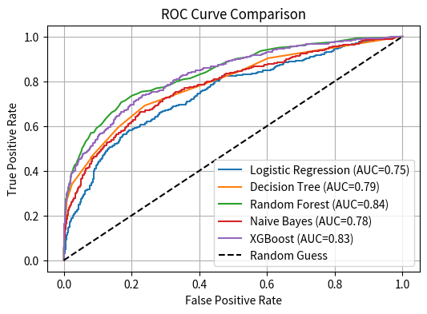

# 銀行客戶流失分析與預測 Bank Customer Churn Analysis

每間銀行都希望可以盡量留住客戶，ABC銀行也不例外，ABC銀行的客服部主管希望客戶來銀行辦理業務後還能持續往來，持續維繫客戶關係，於是請數據分析師協助了解目前流失狀況，找出提高留住率的方法。

## 專案問題與目標:

專案緣起:ABC銀行希望可以盡量留住客戶，減少客戶流失，以維繫客戶關係。 
專案目標:找出目前已流失客戶的特徵，和相關單位協作討論維繫策略並執行以提升客戶留存率。 
專案問題: 
  1.目前的整體流失率為何? 
  2.目前各客戶特徵的流失率為何? 
  3.預測銀行客戶流失率的最佳模型是哪一個? 
  4.客戶流失率的重要特徵為何? 

---

## 📂 資料來源

- 資料集名稱：Bank Customer Churn Dataset
- 資料來源：Kaggle(https://www.kaggle.com/datasets/gauravtopre/bank-customer-churn-dataset)
- 資料筆數:10,000筆ABC銀行客戶
- 資料欄位:
  customer_id(客戶ID) 
  credit_score(信用分數):數值範圍為0~1000，非實際國際信用機構(如FICO)之分數制度。 
  country(國家):France,Geremy,Spain 3個國家 
  gender(性別) 
  age(年齡) 
  tenure(往來期間，單位:年):經了解大部分國家皆以開戶日計算往來期間 
  balance(帳戶餘額) 
  products_number(本行擁有產品數量):經查詢最多4個 
  credit_card(本行信用卡):0=無，1=有 
  active_member(活躍客戶) 
  estimated_salary(預估年薪) 
  churn(流失與否):0=未流失，1=已流失 
---

## 🛠️ 使用平台與分析工具

- 開發平台 : Google Colab
- 資料處理與分析 : Pandas, NumPy ,statsmodels.api
- 資料視覺化 : Matplotlib
- 機器學習 : Scikit-learn, XGBoost
- 模型部署 : Pickle

---

## 🔍 分析流程

0. 讀取Kaggle資料集
1. 認識資料:欄位特徵、是否有區失值
2. 資料清理:數值資料裝箱
3. 資料分析:敘述性統計與交叉分析
4. 模型建置前準備:設定訓練集與測試集
5. 建立預測模型:Logistic Regression、Decision tree、Random Forest、Naive Bayes、XGBoost
6. 計算Accuracy, AUC及Confusion Matrix。
7. 交叉驗證(Cross-Validation):驗證模型穩定程度。
8. 模型比較(ROC):利用Accuracy, AUC畫出ROC圖，比較最佳模型。
9. 分析結論與客戶維繫建議

---

## 🤖 建立機器學習模型後比較

| 模型名稱           | 準確率 Accuracy | AUC 分數 | 準確率排名        |
|--------------------|----------------|----------|---------------------|
| Random Forest       | 0.86          | 0.83     |   1             |
| Decision Tree       | 0.85          | 0.79     |    2            |
| XGBoost             | 0.84          | 0.83     |     3           |
| Naive Bayes         | 0.83          | 0.78     |    4            |
| Logistic Regression | 0.81          | 0.75     |     5           |

📈 五個模型的 ROC 曲線圖如下：  

---

## 📌 分析結論與客戶維繫建議

一、經分析結果如下: 
1.整體流失率占20.3%。 
2.個客戶特徵交叉分析結果如下: 
(1)性別:女性流失率高於男性。 
(2)國家:德國的客戶流失率最高，法國客戶流失率最低。 
(3)產品數量:擁有3個產品以上的客戶流失比例較高。 
(4)信用卡:有無信用卡流失率差距在1%以內，幾乎相等。 
(5)活躍客戶:非活躍客戶流失率較高。 
(6)往來期間:往來期間1年內的客戶流失率較高，往來6~8年的流失率最低。 
(7)信用分數:400分以下流失率最高，801分以上流失率最低。 
(8)年齡:51~60歲的客戶流失率最高，20歲以下的流失率最低。 
(9)帳戶餘額:51~100萬的流失率最低。(.) 
3.經比較5個模型後，隨機森林模型(Random Forest)準確率最高，因此以此模型為主。 
4.流失客戶重要特徵為年齡、年薪、帳戶餘額、信用分數及產品數量。(.) 
二、客戶維繫建議 
建議針對50歲以上、帳戶餘額100萬以下、購買產品數量較多的客戶進行客戶維繫，這些族群客戶正值中老年，可能因有家庭生活開銷壓力會逐利益而居，因此可以依專案方式增加活存利率、換匯優惠，提供ACH可將薪水自動轉至本行帳戶免手續費，如客戶有信用卡可以減免年費等優惠吸引客戶。
