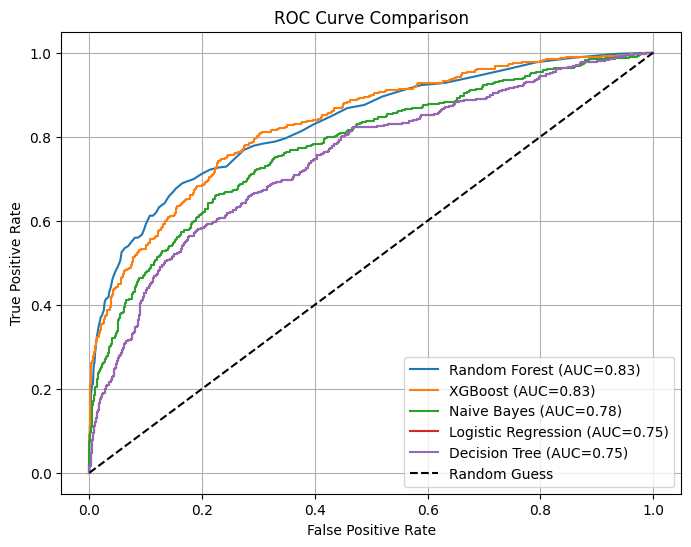

# 銀行客戶流失分析與預測 Bank Customer Churn Analysis

每間銀行都希望可以盡量留住客戶，ABC銀行也不例外，ABC銀行的客服部主管希望客戶來銀行辦理業務後還能持續往來，持續維繫客戶關係，於是訂定出本年度的年度計畫，請數據分析師協助了解目前流失狀況，以數據分析之結果提供建議方案，會同與客戶關係相關單位執行提高留住率之行動。

## 🎯 專案問題與目標:

- 專案緣起:ABC銀行希望可以盡量留住客戶，減少客戶流失，以維繫客戶關係。
- 專案目標:找出目前已流失客戶的特徵，和相關單位協作討論維繫策略並執行以提升客戶留存率。
- 專案問題:
  - 目前的整體流失率為何?
  - 目前各客戶特徵的流失率為何?
  - 預測銀行客戶流失率的最適模型是哪一個?
  - 客戶流失率的重要特徵為何?

---

## 📂 資料來源

- 資料集名稱：Bank Customer Churn Dataset
- 資料來源：Kaggle(https://www.kaggle.com/datasets/gauravtopre/bank-customer-churn-dataset)
- 資料筆數:10,000筆ABC銀行客戶
- 資料欄位:
  - customer_id(客戶ID)
  - credit_score(信用分數):數值範圍為0~1000，為數據集提供之模擬分數，非使用實際國際信用機構(如FICO)之分數制度。
  - country(國家):France,Geremy,Spain 3個國家
  - gender(性別)
  - age(年齡)
  - tenure(往來期間，單位:年):經了解大部分國家皆以開戶日計算往來期間
  - balance(帳戶餘額)
  - products_number(擁有本行產品):4個產品，以代號1~4表示。
  - credit_card(本行信用卡):0=無，1=有
  - active_member(活躍客戶)
  - estimated_salary(預估年薪)
  - churn(流失與否):0=未流失，1=已流失
  
---

## 🛠️ 使用平台與分析工具

- 開發平台 : Google Colab
- 資料處理與分析 : Pandas, NumPy ,statsmodels.api
- 資料視覺化 : Matplotlib
- 機器學習 : Scikit-learn, XGBoost
- 模型部署 : Pickle

---

## 🔍 分析流程

0. 讀取Kaggle資料集
1. 認識資料:欄位特徵、是否有缺失值、是否有重複資料
2. 資料清理:進行數值資料裝箱(pd.cut)
3. 資料分析:敘述性統計、交叉分析、裝箱資料交叉圖表
4. 模型建置前準備:設定訓練集(80%)與測試集(20%)比例
5. 建立預測模型:選用5個模型(Logistic Regression、Decision tree、Random Forest、Naive Bayes、XGBoost)，並計算Accuracy, AUC,F1 score及Confusion Matrix
6. 交叉驗證(Cross-Validation):驗證5個模型穩定程度。
7. 模型比較(ROC):利用Accuracy, AUC畫出ROC圖，評估最適模型。
8. 分析結論與客戶維繫建議:統整及解釋結果，並提供客戶維繫之策略方案建議。

---

## 🤖 建立機器學習模型後比較

📈 模型的ROC曲線(Receiver Operating Characteristic Curve)
- ROC曲線:全名為Receiver Operating Characteristic Curve，其目的是呈現不同閾值(threshold，機率的門檻值)會對決策指標(TPR.FPR)的影響。
  - False Positive Rate:模型預測為非流失，測試集真實狀況為流失，決策錯誤比率。公式= 決策錯誤筆數 / 測試集總筆數。
  - True Positive Rate:模型預測為流失，測試集真實狀況為流失，決策正確比率。公式= 決策正確筆數 / 測試集總筆數。 
- 本專案的ROC圖如下：  
   
- 各指標整理如下表: 
  | 模型名稱             | Accuracy  | precision  | recall    | f1-score | Cross-Validation | AUC      | 
  | ------------------  | --------  | ---------- | --------- | --------- | ----------------| -------- | 
  | Logistic Regression | 0.81      | 0.78       | 0.81      | 0.78      | 0.80            | 0.75     | 
  | Decision Tree       | 0.85      | **0.84**   | 0.85      | 0.82      | 0.79            | 0.79     | 
  | Random Forest       | **0.86**  | **0.84**   | **0.86**  | **0.84**  | **0.86**        | **0.83** | 
  | Naive Bayes         | 0.83      | 0.81       | 0.83      | 0.81      | 0.78            | 0.78     | 
  | XGBoost             | 0.84      | 0.83       | 0.84      | 0.83      | **0.86**        | **0.83** |  
依據上表，Random Forest各項指標皆為最高，因此**選擇Random Forest為最適合預測模型**。

---

## 📌 分析結論與客戶維繫建議

- 經分析結果如下:
  - 整體流失率占20.3%。
  - 客戶特徵交叉分析結果如下:
    - 性別:女性流失率(25.1%)高於男性(16.4%)，兩者差距8.7%。
    - 國家:德國的客戶流失率最高(32.4%)，法國客戶流失率最低(16.2%)，兩者相差16.2%。
    - 產品種類:擁有4種產品的客戶全部流失(100%)，2種產品的流失率最低(7.8%)。
    - 信用卡:有無信用卡流失率差距在1%以內，幾乎相等。
    - 活躍客戶:非活躍客戶流失率(26.9%)高於活躍客戶(14.2%)，兩者差距12.6%。
    - 往來期間:往來期間1年內的客戶流失率較高，往來6~8年的流失率最低。
    - 信用分數:400分以下流失率高達100.0%，其他各族群流失率皆在19.7%~21.3%之間。
    - 年齡:51-60歲的客戶流失率最高(56.2%)，20歲以下的流失率最低(5.6%)，兩者差距50.6%。
    - 帳戶餘額:不足6萬的流失率最高(28.4%)，6~10萬流失率最低(22.0%)，兩者差距6.4%。
    - 預估年薪:16萬以上流失率最高(21.6%)，不足6萬流失率最低(19.8%)，但最高與最低僅差距1.9%。
  - 經比較5個模型後，隨機森林模型(Random Forest)在各個決策指標皆為最高，因此以此模型為最適預測模型。
  - 流失客戶重要特徵為年齡、帳戶餘額、信用分數及產品數量。
- 客戶維繫建議:  
  建議針對51~60歲的客戶、帳戶餘額6萬以下、信用分數為400分以下、購買3種產品以上的客戶進行客戶維繫，這些族群客戶正值中老年，可能因家庭生活開銷壓力大，可能有信用卡或貸款遲繳情形，因此較可能會逐利益而居，因此可以依專案方式給予以下優惠:
  - 增加活存利率、減免跨提跨轉次數
  - 提供ACH可將薪水自動轉至本行帳戶免手續費。
  - 如客戶有本行信用卡可以減免年費，調降循環利率，減免循環利息費用或減免逾期繳款費用。
  - 如有貸款需求，可專案給予較低的利率，或目前已有貸款但利率較高可以降低借款利率或延長繳納期數等優惠吸引客戶。
