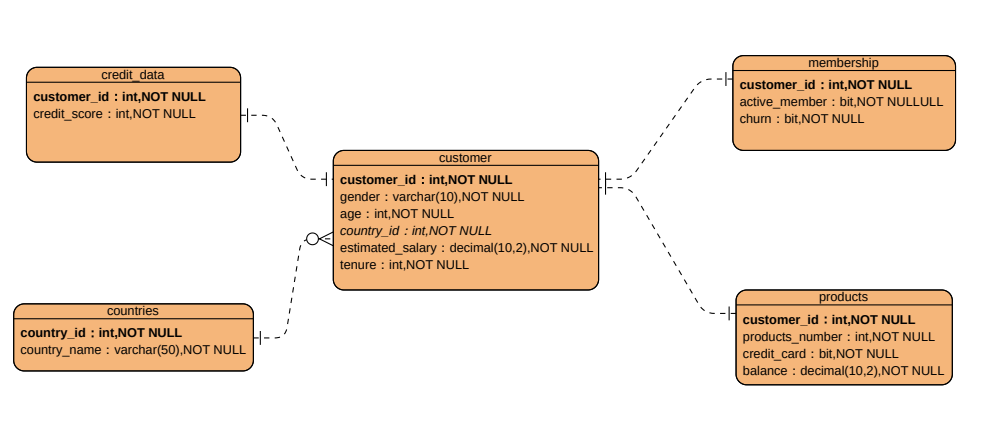

## 📝ABC銀行客戶流失現況之初步分析
每間銀行都希望可以盡量留住客戶，ABC銀行也不例外，ABC銀行的客服部主管希望客戶來銀行辦理業務後還能持續往來，持續維繫客戶關係，希望能初步掌握目前客戶樣貌與流失情況，作為未來是否需進行後續深入分析流失原因的依據。因此，本案先以SQL做初步分析，了解現在客戶樣貌與潛在風險狀況。

### 1️⃣專案問題與目標:

- 專案緣起:ABC銀行希望能掌握目前的客戶樣貌、流失與潛在風險狀況，再決定是否進行後續深入分析依據。
- 專案目標:使用SQL了解目前客戶樣貌、風險指標與流失現況，以支持上層主管的決策。
- 專案問題:
    - 目前的整體客戶流失率為何？
    - 目前有流失的客戶樣貌為何?
    - 目前經營的國家的平均估計年薪、信用分數與平均帳戶餘額為何?
    - 目前具有高薪的客戶但流失的客戶數有多少?（估計年薪大於 15 萬）
    - 利益導向客戶比例。(持有信用卡、仍不活躍且流失的客戶比例)
    - 各國活躍會員流失率為何？
    - 有哪些客戶可視為高風險？
        - 各國的平均信用分數為何?
        - 依信用分數將churn risk分風險等級貼標，了解各風險等級客戶量。
    

### 2️⃣資料來源

- 資料集名稱：Bank Customer Churn Dataset
- 資料來源：Kaggle(https://www.kaggle.com/datasets/gauravtopre/bank-customer-churn-dataset)
- 資料筆數：10,000筆ABC銀行客戶

- table與欄位關聯說明：[點這裡開啟](dataset_info.txt)

### 3️⃣資料正規化與ER Model

- 資料庫正規化(Normalization)原因
    
    因Kaggle所提供原始資料表包含客戶個人基本資料、信用資料、產品資料與帳戶狀態等，違反基礎資料正規化標準。為能將專案較貼近實務資料庫狀況，因此將原始資料進行基礎正規化，拆分成5個資料表，讓每個資料表欄位能對應單一主題，提升資料的維護與查詢彈性，也更符合實務上資料庫設計狀況。
    

- 正規化後的資料庫實體關聯圖(ER-Model)
    
    
    

### 4️⃣使用平台與分析語法：

- 使用平台：Microsoft SQL Server 2022(SSMS)
- 查詢資料使用到的語法：
    - 基礎語法：SELECT, FROM ,WHERE, GROUP BY, ORDER BY, Aggregate Functions, IIF
    - 中階語法：INNER JOIN, Subquery, CTE(Common Table Expression), ROUND, CONVERT, CASE WHEN
    - 進階語法：Windows Function
    - 查詢封裝：Stored Procedure，儲存常用的sql語法
    - 視覺化做準備：View，提供給Power BI/Tableau視覺化工具進行後續布置

### 5️⃣分析結果、洞察與建議

- 資料查詢分析結果
    - 整體流失率：在10,000份樣本中，整體客戶流失率為2037名，佔20.37%。
    - 客戶樣貌與流失率：
        - 性別：女性流失率較高，佔整體客戶數的11.39%，全體女性客戶的25.07%，與男性客戶流失全體佔比8.98%，高出2.41%
        - 國家：以全體客戶數佔比而言，德國客戶流失率佔比最高(8.14%)、法國次之(8.10%)、西班牙最低(4.13%)；但以國家內相比，德國內流失率最高(32.44%)、西班牙內次之(16.67%)(16.67%)、法國內反而最少(16.15%)
        - 產品種數：以全體客戶數佔比而言，僅持有1種產品的客戶流失率最高(14.09%)、2種次之(3.48%)、4種最少(0.60%)；但是以種類裡流失率觀點來看，持有4種產品的客戶流失率最高(100.00%)、其次是3種(82.71%)、2種最少(7.58%)。
        - 信用卡持有：以全體客戶數佔比而言，持有信用卡的流失比率較高(14.24%)；以持有種類裡比較，持有信用卡的流失率佔全體持信用卡的20.18%，未持有佔20.81%，差距0.63%。
        - 活躍客戶：以全體客戶數佔比而言，流失前已非活躍客戶佔13.02%，高於流失前還是活躍客戶的7.35%。以分活躍組內而言，流失前已非活躍客戶佔26.85%，高於流失前還是活躍客戶的14.27%。
    - 目前所經營的3個國家(法國、德國、西班牙)：
        - 平均估計年薪：德國為101.1K,法國為99.9K,西班牙為99.4K。
        - 平均信用分數：德國與西班牙為651分、法國為649分。
        - 平均帳戶餘額：德國119.7K，法國62.1K、西班牙61.8K。
    - 目前具有高薪(估計年薪大於 15 萬)的客戶但流失的客戶數有527名，佔全體客戶的5.27%。
    - 目前利益導向客戶(持有信用卡、仍不活躍且流失的客戶比例)人數為942名，佔全體客戶的9.42%。
    - 各國活躍會員流失率：德國為23.72%、法國為11.50%、西班牙為10.75%。
    - 風險貼標：目前先將信用分數分風險等級(churn_risk)進行貼標，高風險客戶占6.32%(平均462.93分)、中風險客戶占62.52%(平均分614.44分)、低風險客戶占31.16%(平均760.99分)。
- 分析洞察：
    - 產品數量與流失率呈負向關係。持有產品數量越多，再組間流失率卻越高，持有4種商品的客戶全部都流失，可能有必要針對這些客戶進行滿意度調查或質性調查，了解產品不滿足這類客群之原因。
    - 持有信用卡的流失比率較未持有高，可能為信用卡的回饋不具市場競爭力，沒有讓客戶持續使用信用卡的誘因。
    - 以國家而言之，德國的經濟能力較為其他兩國高，但活躍會員的流失率也最高，可能德國客戶不只重視產品，也很在意後續的客戶服務上。
- 後續分析建議
    - 綜合上述分析，客戶流失與多項特徵可能存在關聯性，建議後續可持續了解那些客戶樣貌對流失率影響較大，建立流失率預測模型。後續亦可結合視覺化儀表板與主動關懷機制，將能有效提升客戶留存率，強化銀行營運穩定性。
